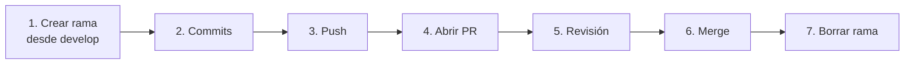

<div align="center">

# 💻 Programación III

**Juan Valenzuela** · Universidad UTE · 2026


</div>

---

## 📚 Contenido

| # | Tema | Rama | Estado |
|:-:|------|------|:------:|
| 01 | Fundamentos de HTML | `FEATURE-2026-2-01-HTML-FUNDAMENTALS` | 🚧 |

---

## ✍️ Commits

Claros, cortos y consistentes.

```
tipo(JIRA-XX): descripción breve del cambio
```

| Tipo | Uso |
|------|-----|
| `feat` | ✨ Nueva funcionalidad |
| `fix` | 🐛 Corrección de error |
| `docs` | 📝 Documentación |
| `style` | 🎨 Estilos / formato |
| `refactor` | ♻️ Refactorización |
| `test` | ✅ Pruebas |
| `chore` | 🔧 Mantenimiento |

---

## 🌿 Ramas

En **MAYÚSCULAS** y separadas por guiones.

```
TIPO-JIRA-XX-DESCRIPCION-CORTA
```

| Tipo | Uso |
|------|-----|
| `FEATURE` | ✨ Nueva funcionalidad |
| `BUGFIX` | 🐛 Corrección de error |
| `HOTFIX` | 🚑 Arreglo urgente en producción |
| `DOCS` | 📝 Documentación |
| `RELEASE` | 🚀 Preparación de release |

---

## 🔀 Pull Requests

**Título:** mismo formato que ramas y commits.

```
FEATURE-JIRA-01: agrega endpoint POST para incluir bancos
```

**Descripción:**

- [ ] Qué se hizo y por qué
- [ ] Issue vinculado (`Closes #JIRA-01`)
- [ ] Cambios principales en viñetas
- [ ] Capturas de prueba *(opcional)*

---

## 🔄 Flujo de trabajo



---

## ⚡ Ejemplo rápido

| Elemento | Ejemplo |
|----------|---------|
| 🌿 Rama | `FEATURE-JIRA-01-ENDPOINT-POST-BANCOS` |
| ✍️ Commit | `feat(JIRA-01): agrega endpoint POST para incluir bancos` |
| 🔀 PR | `FEATURE-JIRA-01: agrega endpoint POST para incluir bancos` |
| 📸 Captura | Payload JSON y respuesta exitosa del endpoint |

---

<div align="center">

Hecho con ☕ por **Juan Valenzuela**

</div>
